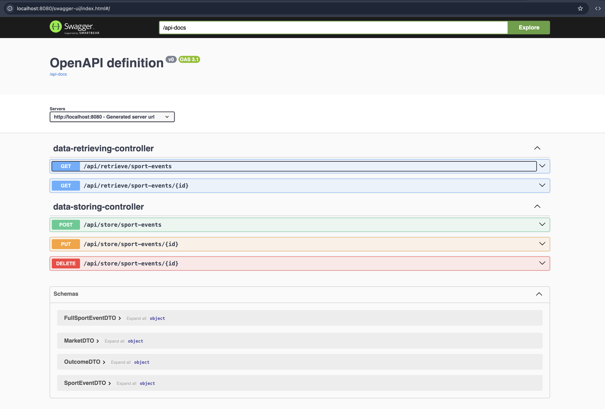
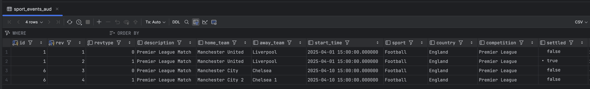

## It's solution for test task from BV-group

`docker-compose up` in root folder

[Swagger](http://localhost:8080/swagger-ui/index.html#/)

[Full health](http://localhost:8080/actuator/health)
[Liveness probe](http://localhost:8080/actuator/health/liveness)
[Readiness probe](http://localhost:8080/actuator/health/readiness)

### Auditing and versioning 

