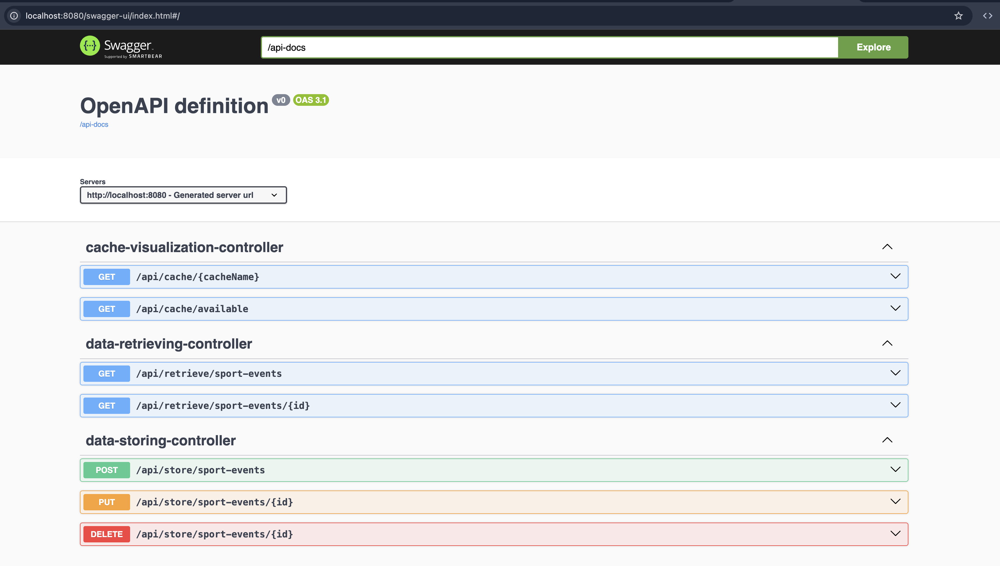

## Solution for test task from BV-group

[BV Technical Challenge.pdf](media/BV%20Technical%20Challenge.pdf)

I’m unclear about the requirement: `Design the services with the assumption that they don’t have access to each other.` Does this mean I should implement both the data storing service and the data retrieving service within a single microservice, or should I create separate microservices for each? If separate microservices are intended, I’m unsure how to invalidate the cache in the retrieving service when the storing service updates the data, given that direct communication (e.g., REST, queues, RPC) seems restricted. I considered a database trigger-based approach to handle cache invalidation but couldn’t find a feasible solution after initial research—though it might be possible with further investigation. Based on this, I assume combining both services into one microservice would be a simpler and more straightforward approach.

```bash
docker-compose up
```

[Swagger](http://localhost:8080/swagger-ui/index.html#/)


[Full health](http://localhost:8080/actuator/health)
[Liveness probe](http://localhost:8080/actuator/health/liveness)
[Readiness probe](http://localhost:8080/actuator/health/readiness)

### Auditing and versioning 


